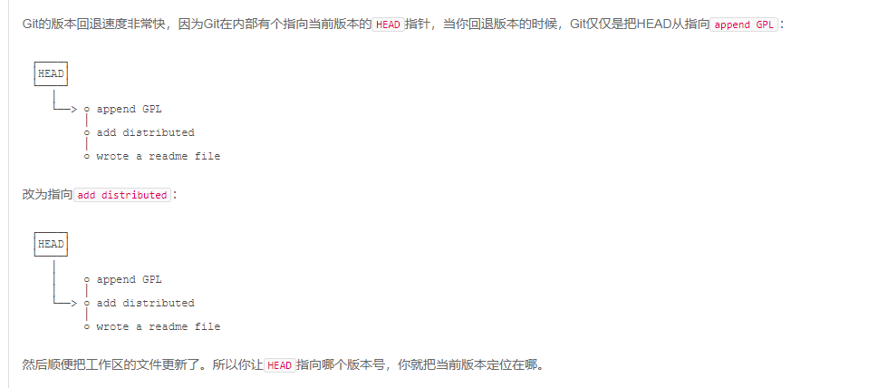
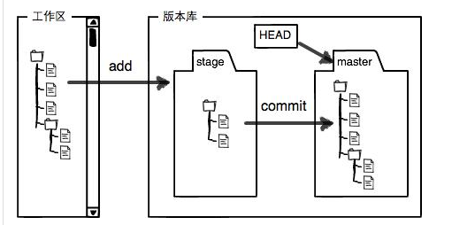
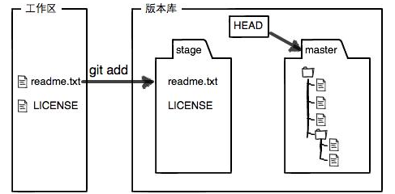
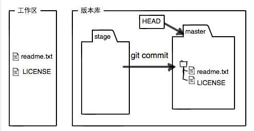
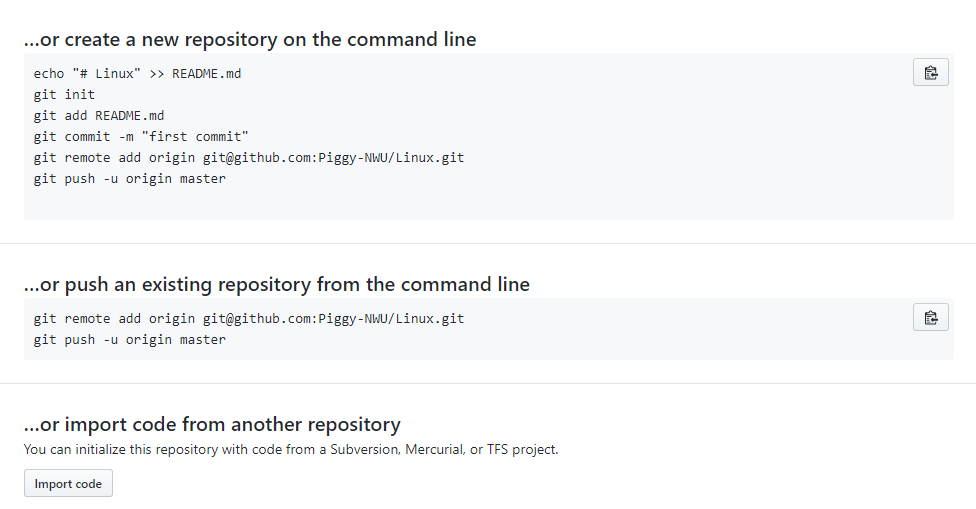

# 基础操作

## 创建版本库

`pwd` 用于显示当前所在目录。`cat readme.txt `用于查看文件。

选择好要当仓库的文件夹。通过 `git init`命令把这个目录变成Git可以管理的仓库。

## 添加文件到本地仓库

```git
git add readme.txt                            //添加到暂存区。 add的作用就是添加至暂存区。
git commit -m 'wrote a readme file'           //从暂存区添加到仓库，-m是本次提交的说明，可以输入任意内容

git add file1.txt file2.txt                   //git可以一次add多个文件。也可以多次使用。commit一次提交全部
```

## 版本回退（回退版本库的更新）

回退的是版本库。顺便把工作区的也更新了。 后面reset还可以撤销暂存区。

```
git log                                          //查看提交日志的记录 版本号是系统计算出来的
git log --pretty=oneline                         //把所有记录分别简化成一行

/*
回退上一个版本是HEAD^,上上一个就是HEAD^^,回退一百个是HEAD~100. --hard参数后面会讲
*/
git reset --hard HEAD^

git reset --hard 1094a                           //回到未来，找到之前的版本号，即可。 版本号写前几位即可，太短了git无法确定是哪一个。

//关掉了电脑，后悔了。想恢复到新版本，但是找不到版本号了怎么办？
git reflog                                        //记录每一次的命令。


```



## 工作区和暂存区

工作区：就是在电脑里能看到的目录。

版本库：工作区有一个隐藏目录.git .这是Git的版本库。

Git的版本库里存了很多东西，其中最重要的就是称为stage（或者叫index）的暂存区，还有Git为我们自动创建的第一个分支`master`，以及指向`master`的一个指针叫`HEAD`。



使用add后：



使用commit后：



## 管理修改（工作区和版本区文件的区别）

Git跟踪管理的是修改，而非文件。利用暂存区来跟踪管理。

每次修改，如果不用`git add`到暂存区，那就不会加入到`commit`中。

```git
git diff HEAD --readme.txt                                      //查看工作区和版本库最新版本的区别。
```


## 撤销修改（撤销工作区和暂存区）

### 撤销工作区的修改：

```git
git checkout -- readme.txt                             //格式一点都不能错，大小写，空格等。
git restore -- readme.txt   
```

命令`git checkout -- readme.txt`意思就是，把`readme.txt`文件在工作区的修改全部撤销，这里有两种情况：

一种是`readme.txt`自修改后还没有被放到暂存区，现在，撤销修改就回到和版本库一模一样的状态；

一种是`readme.txt`已经添加到暂存区后，又作了修改，现在，撤销修改就回到添加到暂存区后的状态。

总之，就是让这个文件回到最近一次`git commit`或`git add`时的状态。

### 撤销暂存区的修改：

```git
git reset HEAD readme.txt                              //可以把提交到暂存区的文件放回到工作区。
```

## 删除文件

```git
rm test.txt      									//从文件管理器中删除。（工作区）

git status 											// Git知道我删除了，并且给出相关提示。因为版本区和工作区不一样了

git rm test.txt    									 
git commit -m'remove test.txt'						  // 将本件从版本库中彻底删除.删除也要commit结尾

git checkout -- test.txt							 //误删了就从版本区还原。
 //git checkout其实是用版本库里的版本替换工作区的版本，无论工作区是修改还是删除，都可以“一键还原”
```

# 远程仓库

## 添加仓库 ，上传数据

先设置ssh。 [教程](https://blog.csdn.net/huangqqdy/article/details/83032408)

本地仓库的名字必须和github中的一致。必须从仓库中上传，否则出错。后续如下（github官方的)： 




```git
//在本地每次创建一个新的库时（这个库名必须和github里的一致），要去关联github中的库，都需要
git remote add origin git@github.com:piggy-nwu/learngit.git    //建立关联，一次就行了。

git push -u origin master   			  			//第一次推送的时候,由于远程库是空的需要加上-u(不确定因为什么)
git push origin master 							   //后面推送的时候不需要 -u


//就是在本地的仓库和github的仓库建立一对一连接。
```

## 下载

```git
git clone git@github.com:piggy-nwu/learngit.git               //地址也可以从github仓库获得。
```

# 分支管理

## 创建、合并分支

[分支运行的原理](https://www.liaoxuefeng.com/wiki/896043488029600/900003767775424)

可以理解为，每一个分支都有自己的暂存区，版本库。 最后可以融合。

```git
git branch 											//查看分支

git branch <name>									//创建分支

git switch <name>  or  git checkout<name>			  //切换分支

git switch -c <name> or git checkout -b <name>         //创建+切换分支 （我觉得还上面的好一些）

git merge <name> 									//合并某分支（name)到当前分支

git branch -d <name>								//删除分支
```

## [分支冲突的解决方法](https://www.liaoxuefeng.com/wiki/896043488029600/900004111093344)

## 分支管理策略

这块有点没看懂。 后面再补吧

[## 临时去修复bug怎么办？](https://www.liaoxuefeng.com/wiki/896043488029600/900388704535136)

```git
git stash										//保存工作现场。

git stash apply 								//选择恢复工作现场
git stash drop									//删除那个工作现场

git stash pop									//恢复并删除保存的工作现场

git stash list   								//查看保存的工作现场有哪些

git stash apply stash@{0}						//恢复指定的工作现场
```

## feature分支

## 多人协作

## Rebase

# 标签管理


